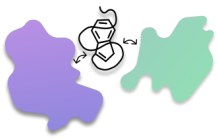
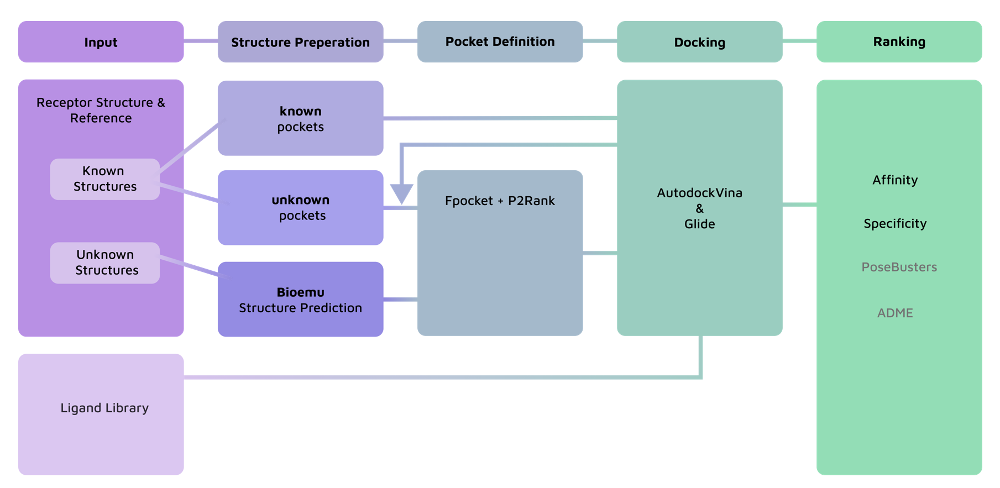
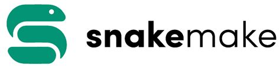

<p align = "center"><strong>The easiest way to find the most promising Ligands for your Protein</strong></p>

Welcome to your protein-ligand matchmaker!
If you want to find out which ligands might bind to your protein, you have come to the right place. Onedock provides you with a variety of possibilities to screen your library of small molecules for the best candidates for your protein of interest. You have no idea where your binding pocket is? No problem! There is another protein that might bind the same ligands? Don't worry, we'll find the ones that are specific for your protein.


<p align="center">
  <figure style="display:inline-block; margin:20px; text-align:center;">
    
    <figcaption><sub>Find the Ligands with the highest specificity for your Protein</sub></figcaption>
  </figure>

  <figure style="display:inline-block; margin:20px; text-align:center;">
    
    <figcaption><sub>Identify unknown binding sites</sub></figcaption>
  </figure>

  <figure style="display:inline-block; margin:20px; text-align:center;">
    
    <figcaption><sub>Work with Proteins without a defined Structure</sub></figcaption>
  </figure>
</p>


This Readme will take you through the workings of the pipeline. We'll show you what possibilities you have, how to use it on your own device, and what you need to consider when using the pipeline. 

## How to find your way through the Pipeline 


As you can see, there are a lot of different possibilities, so let's walk through them. 

 
<details>
  <summary> You allready know the protein structure and binding pocket</summary>
    Good for you!
    If you allready know the protein binding region of your ligand candidate (e.g. a highly functional part of the protein) and only want ligands that bind to this pocket, you can just upload your protein and your ligand library on the first input page and directly proceed to docking. 
</details><br>

<details>
  <summary> You don't know the binding pocket, but you know the protein structure</summary>
    Great, this way you can try out our pocket detection page. There, you can predict the pockets using detection tools fpocket and P2Rank. Using filters (that you can set yourself) and by comparing the two methods, we'll compute the best pockets for you, so that you can proceed with docking. 
</details><br>

<details>
  <summary> I only have the sequence of my protein </summary>
    So sad :( 
    But don't worry, we'll use BioEmu to predict the structure and use the pocket detection page. There, you can predict the pockets using detection tools fpocket and P2Rank. Using filters (that you can set) and by comparing the two methods, we'll compute the best pockets for you, so that you can proceed with docking. 
</details><br>


On the docking page, you will use AutoDock vina to dock the ligands to the (pre)defined pocket. It will give out the best ligand candidates which you can filter on the ranking site using ADME and the lipinsky rule of five. 

In the end you will be provided with your pocket residues, your final ligand candidates and their respective filtering scores. Additionally, OneDock will visualize the Ligans candidates and how they bind the protein. 
By looking at the different scores you can then identify the Ligand that fits your requirements best. 

<details>
  <summary> What about other proteins that can bind my Ligands?</summary>
    You can upload an additional reference strucuture on the upload page. OneDock will repeat the procedure for this protein and compare the docking results to the results of your protein of interest. This way you get the ligands that are specific for your protein. 
</details><bp>
**are we including the additional pockets in the predefined pocket situation?**


## How is the code structured and how can I use it on my device?
### General structure
This is the structure of OneDock and this GitHub page:<bp>
```text
OneDock
├── .devcontainer/          
│   ├── devcontainer.json
│   └── Dockerfile
├── app/
│   ├── .streamlit/         # streamlit layout
│   │   └── config.toml
│   ├── images/             #images needed for the app
│   ├── pages/              # streamlit pages
│   │   ├── 1_Structure_Preparation.py
│   │   ├── 2_Pocket_Prediction.py
│   │   ├── 3_Docking.py
│   │   ├── 4_Results.py
│   │   └── 5_ADME_Screening.py
│   ├── Home.py              # Main Streamlit app
│   └── utils.py             # Helper functions 
├── config/ 
│   └── config.yaml          # Configuration for Snakemake
├── data/
│   ├── inputs/              # Input files
│   ├── interim/             # Interim files 
│   └── results/             # Output files 
├── workflow/
│   ├── scripts/              
│   │   ├── bioemu_pipeline.py
│   │   ├── convert_smi_to_bdbqt.py
│   │   └── docking_script_with_residues.py
│   └── Snakefile            # Main entry point for Snakemake
└── .gitignore
README.md
images_readme/              

```

### How to use OneDock
For the ideal use of OneDock install [VS Code](https://code.visualstudio.com/download) and [docker](https://www.docker.com/). You can then clone the repository:

```bash
git clone https://github.com/meet-eu-25-26/Heidelberg_Team_2.git
```
Open the OneDock folder in VS code and choose *Dev Containers: Rebuild and Reopen in Container*.
Once you are in your container you can start OneDock:
```bash
streamlit run app/Home.py
```
OneDock will guide you through the steps according to your wishes. 

## The Tools

### Streamlit
<p align = "center">
</p>

We are using [streamlit](https://streamlit.io/) to build OneDock. It is a tool that helps you create an interactive app that allows you to set parameters for computation and visualize your results in different ways. This way OneDock is as user-friendly as possible, to provide you with the best experience possible!

### Snakemake 
<p align = "center">
</p>

The pipeline is organized in [snakemake](https://snakemake.github.io/). It allows us to create a workflow system in which files are processed by functions (so called rules) while considering their dependencies. This way, we get a safe and reproducible workflow that is easily integrateable from python. 

### Docker
<p align = "center">
</p> 

We use a [docker](https://www.docker.com/) container to bundle all the dependencies of OneDock. All of the different libraries, system tools,... necessary to run it are defined in a dockerfile from which an image is built. This way, when you use the pipleine, you won't have to worry about installing everything. 

<br>
<br>

OneDock was created by Thaddeus Kühn, Tine Limberg, Manon Mandernach and Sylviane Verschaeve as part of the Meet-EU project of 2025/26.